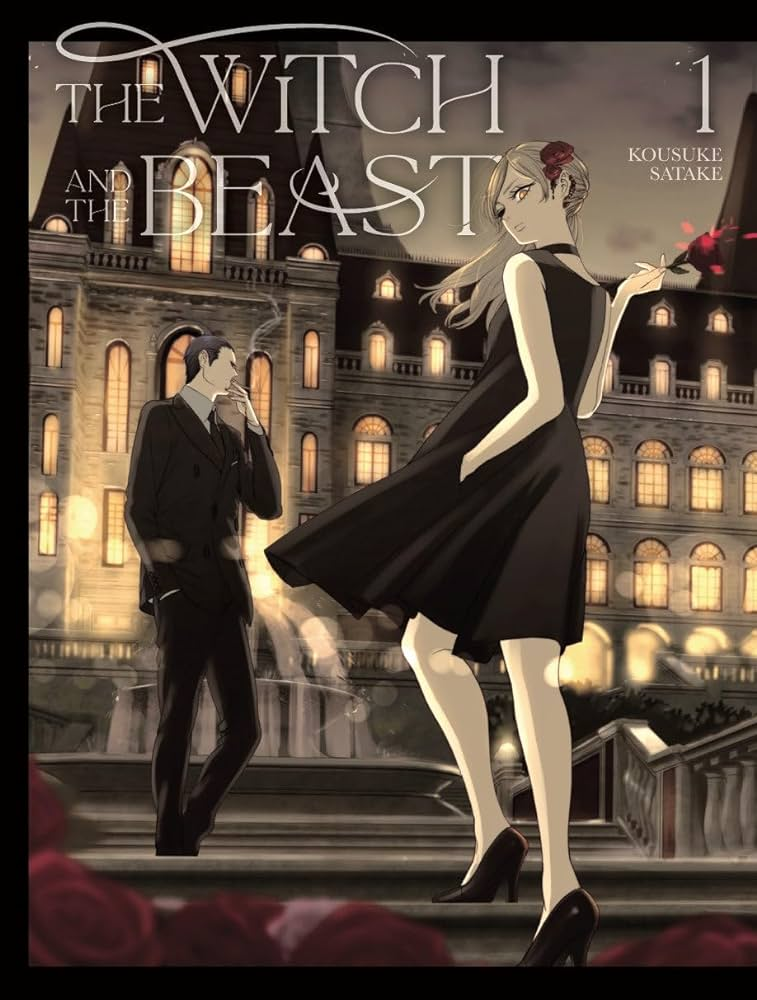

# Welcome
Hello, My name is Brendon He and welcome to my home page!
## About Me
I am an 18 year old currently living in the 6th college dorms at UCSD. I often spend my free time reading and playing games with my friends online. While I prefer working and staying inside my room, I am always willing to go out and meet up with others. Otherwise, if you want to find me you may spot me working at the Canyon Vista Marketplace at Warren.

## My Hobbies
My hobbies include reading and playing games. 
    My favourite games are 
1. Valorant
2. Minecraft
3. Bloons Tower Defense 6

My favourite books and manga are(in no particular order)
- *"What if?"* By Randall Munroe

- *"The Witch and the Beast"* by Kousuke Satake
()
- *"Eleceed"* by Son Je-Ho and ZHENA

You can often find me playing one of these games or reading these stories or one from the same author or similar genre. However, while I like all of these stories and books equally, if you wanted a recommendation, I would tell you to read *"What if?"*. Written by the same author as the xkcd comics, it is full of impossible hypotheticals being answered completely seriously. One of my favourite questions is 
>What would happen if you exploded a nuclear bomb in the eye of a hurricane? Would the storm cell be immediately vaporized?

