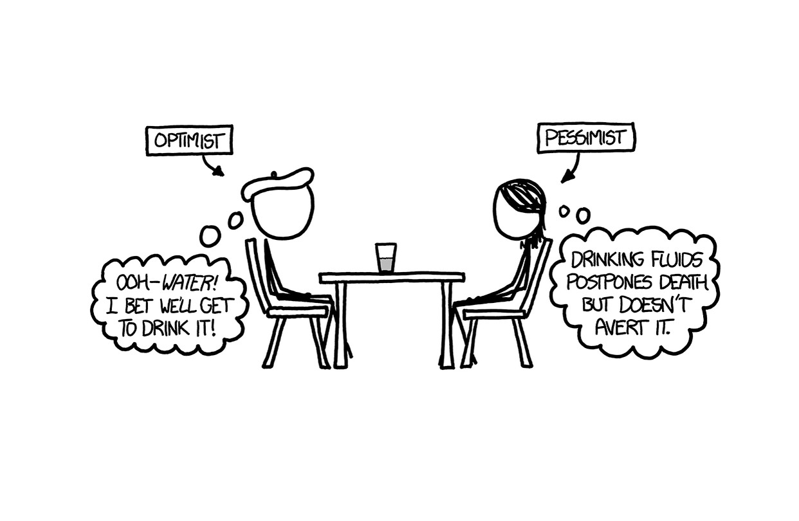

# Welcome
Hello, My name is Brendon He and welcome to my home page!
## Page Directory

## About Me
I am an 18 year old currently living in the 6th college dorms at UCSD. I often spend my free time reading and playing games with my friends online. While I prefer working and staying inside my room, I am always willing to go out and meet up with others. Otherwise, if you want to find me you may spot me working at the Canyon Vista Marketplace at Warren.

## My Hobbies
My hobbies include reading and playing games. 

My favourite games are 
1. Valorant
2. Minecraft
3. Bloons Tower Defense 6

My favourite books and manga are(in no particular order)
- *"What if?"* By Randall Munroe
- *"The Witch and the Beast"* by Kousuke Satake
- *"Eleceed"* by Son Je-Ho and ZHENA

You can often find me playing one of these games or reading these stories or one from the same author or similar genre. However, while I like all of these stories and books equally, if you wanted a recommendation, I would tell you to read *"What if?"*. Written by the same author as the xkcd comics, it is full of impossible hypotheticals being answered completely seriously. One of my favourite questions is 
>What would happen if you exploded a nuclear bomb in the eye of a hurricane? Would the storm cell be immediately vaporized?

His drawings make the book even better, as they add even more of his personality to the book, as he draws them himself. They may not be the greatest, but its perfect for this book.

## Programming Experience
While I am still inexperienced, I still have learned and have grown comfortable with the following languages
- `Java`
- `C and C++`
- `JavaScript`
- `html and CSS`

I am still learning and actively trying to increase the size of this list

## Current Goals
These are the skills/ achievements I want to accomplish by the end of the year(not school year)
- [ ] land an internship
- [ ] learn and become fluent in python
- [ ] become more used to and comfortable using github
- [ ] Make more friends with CS and CS related backgrounds at UCSD

## My Socials
You can always message me through one of these if you want to reach me
- 
- Discord: silverglasses

